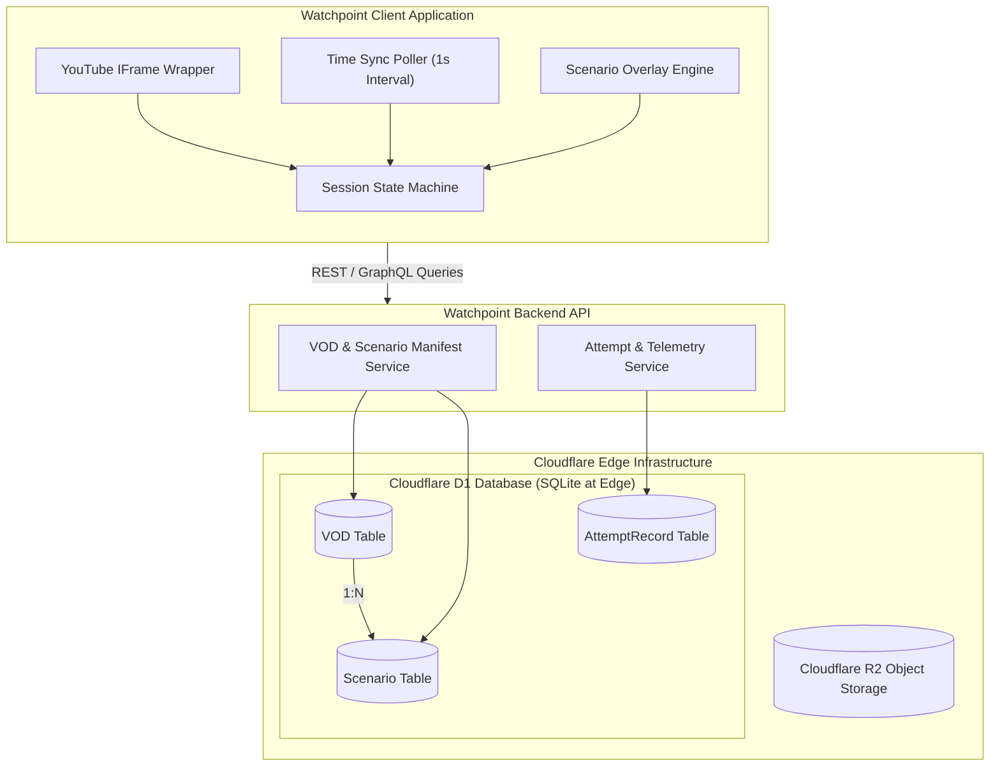
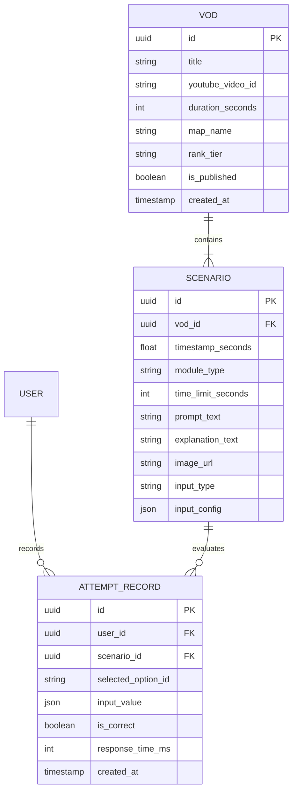
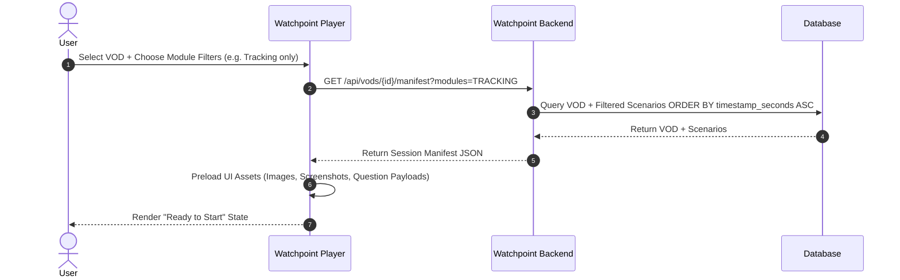
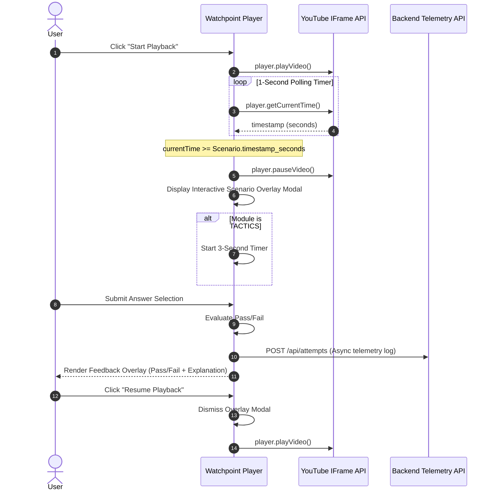

# System Architecture & Domain Design Specification

**Project**: Watchpoint — Interactive Overwatch 2 Game Sense Learning Platform  
**Status**: Draft / Approved Architectural Baseline  
**Date**: 2026-08-06  

---

## 1. Executive Overview

Watchpoint is a browser-based interactive training platform designed to sharpen an Overwatch 2 player's "game sense" through active, scenario-based VOD analysis. 

Rather than passively watching gameplay, Watchpoint embeds high-level ranked VODs that automatically pause at curated timestamps (pre-fight, mid-fight, post-fight). The user is required to make tactical decisions, track enemy ultimate charges, estimate cooldown availability, or recognize situational opportunities before video playback can resume.

This document defines the high-level architecture, database schemas, state synchronization model, and component interactions required to build Watchpoint.

---

## 2. High-Level System Architecture

Watchpoint follows a decoupled client-server architecture:



---

## 3. Data Schemas & Entity Specifications

Watchpoint utilizes a **Hybrid Relational Schema with Polymorphic Input Payloads**. Relational columns enable fast filtering (e.g. by `vod_id` and `module_type`), while JSON payloads store module-specific configuration without requiring schema migrations when adding new interaction types.

### 3.1 Entity-Relationship Overview



### 3.2 `VOD` Entity
Represents an annotated gameplay video session.

| Field | Type | Description |
|---|---|---|
| `id` | UUID / String | Unique identifier |
| `title` | String | Human-readable title (e.g., "Grandmaster Ana VOD - King's Row") |
| `youtube_video_id` | String | Third-party YouTube video identifier (e.g., `dQw4w9WgXcQ`) |
| `duration_seconds` | Integer | Total video duration in seconds |
| `map_name` | String | Overwatch 2 map name (e.g., "King's Row", "Eichenwalde") |
| `rank_tier` | String | Ranked tier context (e.g., "Grandmaster", "Top 500") |
| `is_published` | Boolean | Visibility flag for production playback |
| `created_at` | Timestamp | Creation timestamp |

### 3.3 `Scenario` Entity
Represents a curated pause point within a VOD.

| Field | Type | Description |
|---|---|---|
| `id` | UUID / String | Unique scenario identifier |
| `vod_id` | Foreign Key (`VOD.id`) | Associated VOD |
| `timestamp_seconds` | Float / Int | Video time trigger (1-second marker, $\pm 500\text{ms}$ tolerance) |
| `module_type` | Enum | `STRATEGY`, `TACTICS`, `TRACKING`, `SPATIAL` |
| `time_limit_seconds` | Nullable Int | `3` for strictly timed `TACTICS` scenarios; `null` for untimed |
| `prompt_text` | Text | Question or decision prompt shown to the user |
| `explanation_text` | Text | Analytical explanation rendered after user responds |
| `image_url` | Nullable String | Optional static point screenshot (used in Spatial Location scenarios) |
| `input_type` | Enum | `MULTIPLE_CHOICE`, `PERCENT_SLIDER`, `TIME_SLIDER`, `MAP_PIN_2D` |
| `input_config` | JSON | Polymorphic configuration object containing option list or validation rules |

#### Polymorphic `input_config` Examples

##### V1 Default: `MULTIPLE_CHOICE` (Used for Strategy, Tactics, Tracking, Spatial)
```json
{
  "options": [
    { "id": "opt_a", "text": "0-25% (No Ult)", "is_correct": false },
    { "id": "opt_b", "text": "26-50% (Building)", "is_correct": false },
    { "id": "opt_c", "text": "51-75% (Soon)", "is_correct": true },
    { "id": "opt_d", "text": "76-100% (Ready)", "is_correct": false }
  ]
}
```

##### V2 Upgrade: `PERCENT_SLIDER` (Future Ultimate Tracking)
```json
{
  "target_value": 75,
  "tolerance_margin": 10,
  "min_label": "0%",
  "max_label": "100%"
}
```

##### V2 Upgrade: `MAP_PIN_2D` (Future Spatial Awareness Pin-Drop)
```json
{
  "map_image_url": "/assets/maps/kings_row_point_b.png",
  "target_coordinate": { "x": 0.42, "y": 0.68 },
  "acceptable_radius": 0.08
}
```

### 3.4 `AttemptRecord` Entity
Logs raw user responses for performance analytics.

| Field | Type | Description |
|---|---|---|
| `id` | UUID / String | Unique log entry ID |
| `user_id` | Foreign Key (`User.id`) | User taking the scenario |
| `scenario_id` | Foreign Key (`Scenario.id`) | Scenario being attempted |
| `selected_option_id` | Nullable String | Option ID chosen (if multiple choice) |
| `input_value` | Nullable JSON | Raw input value (for future slider/pin coordinates) |
| `is_correct` | Boolean | Binary PASS/FAIL evaluation |
| `response_time_ms` | Integer | Latency between overlay presentation and answer submission |
| `created_at` | Timestamp | Attempt timestamp |

---

## 4. State Machine & Video Synchronization

### 4.1 Sync Loop & Player Wrapper Rules
1. **Player Controls Restriction**: Native YouTube player controls are hidden/disabled via iframe settings (`controls=0`). The custom UI provides only Play / Pause / Replay Scenario actions. No freeform scrubbing is permitted during interactive practice sessions.
2. **1-Second Polling Loop**: While video is playing, a 1-second interval timer queries YouTube's `player.getCurrentTime()`.
3. **Trigger Execution**:
   * If `currentTime >= nextScenario.timestamp_seconds`:
     1. Call `player.pauseVideo()`.
     2. Transition player state to `SCENARIO_PAUSED`.
     3. Render interactive overlay modal.
     4. If `module_type === 'TACTICS'`, start 3-second countdown timer.
4. **Tab Visibility Protection**: If `document.hidden` triggers while playing, `player.pauseVideo()` is invoked immediately to avoid desynchronization while out of view.

---

## 5. Sequence Flows

### 5.1 Preloading & Session Initialization


### 5.2 Scenario Trigger & Resume Loop


---

## 6. Non-Functional Requirements

1. **Low-Latency Overlays**: Zero network calls must occur between video pause and overlay rendering. All scenario prompts and assets must be pre-fetched during session initialization.
2. **Minimal Data Footprint**: Video streams remain entirely on YouTube CDN. Database storage is restricted to metadata, scenario configs, and lightweight attempt logs.
3. **Extensibility**: The polymorphic `input_config` model allows upgrading input types (e.g. from multiple choice to sliders or map pin drops) without database migration overhead.
